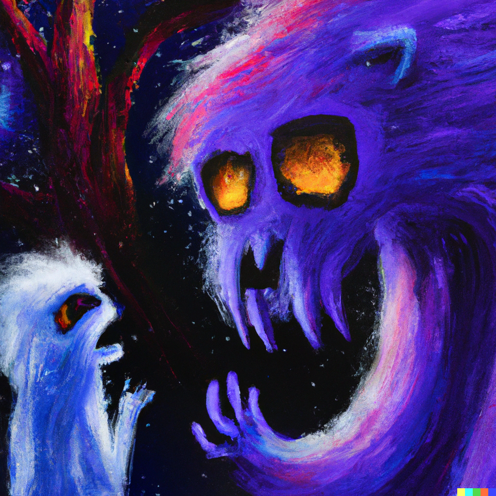
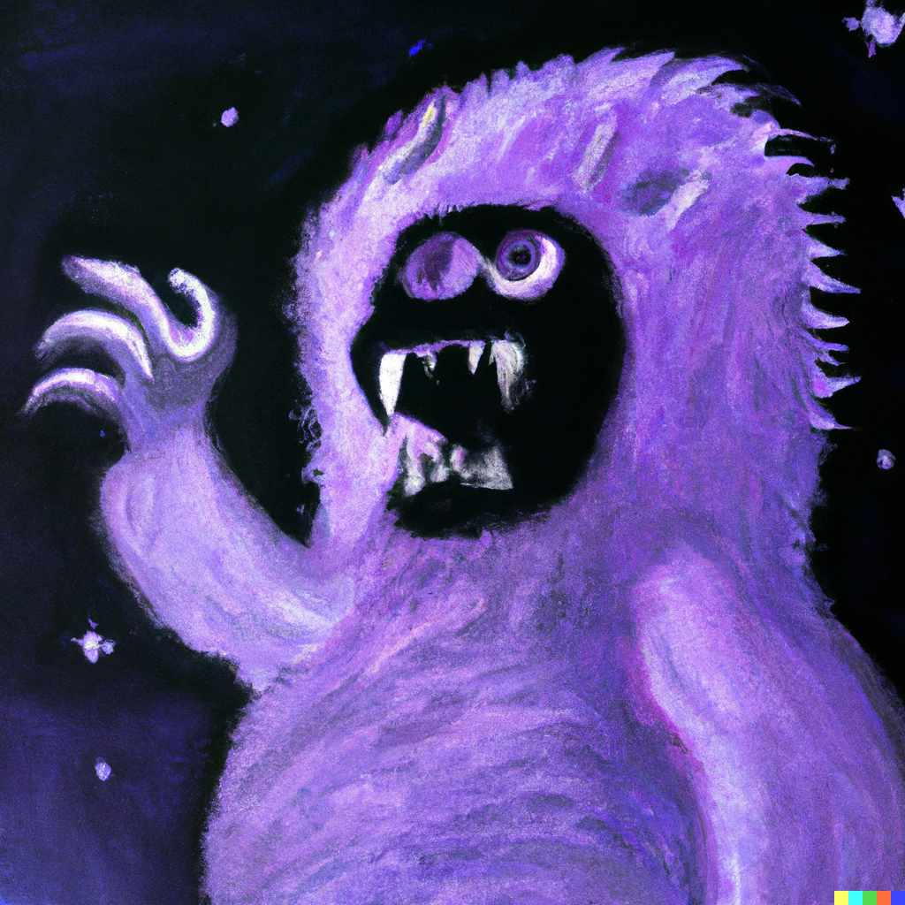

# ☠️ Stat 405 Final Project ☠️

Created by Meera Borle, Isis Burgos, Naomi Consiglio, Carson Foster, and Aidan Gerber.

# Table of Contents
- [☠️ Stat 405 Final Project ☠️](#️-stat-405-final-project-️)
- [Table of Contents](#table-of-contents)
  - [⚡ Quick Info](#-quick-info)
  - [✨ Getting Started](#-getting-started)
  - [🔎 Data Set](#-data-set)
  - [💡 Question](#-question)
  - [📚 Features](#-features)

## ⚡ Quick Info
One sentence project tagline

## ✨ Getting Started
To get started, place the RDS files from https://rice.app.box.com/s/qpc37cwxycp4ge3wsn7449w4qlojpabm into the ./data folder in the project root directory.

## 🔎 Data Set
Explain the data set
 
## 💡 Question
Talk about the question to be solved
 
 
## 📚 Features
   - List features here as they are created
